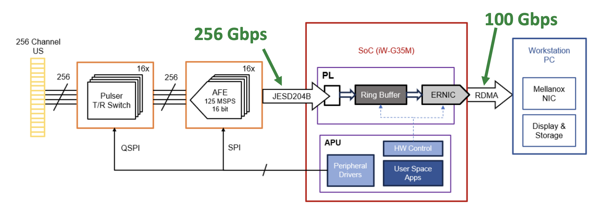
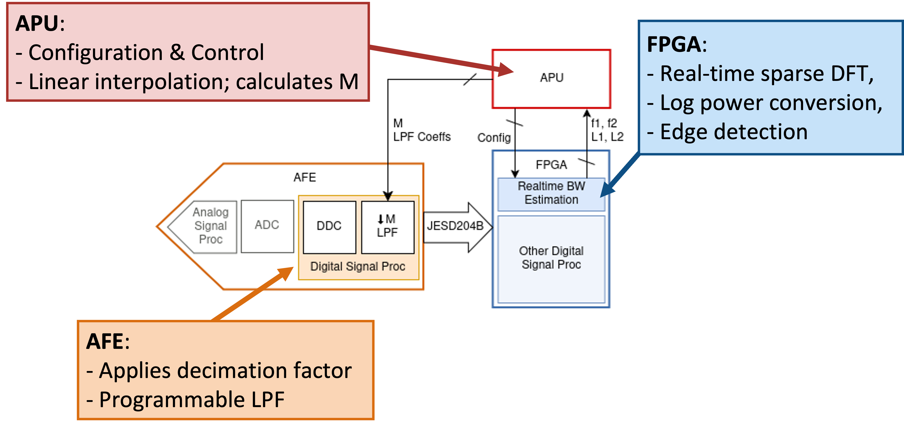
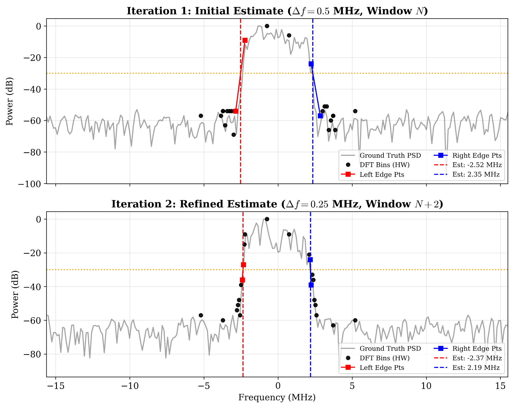
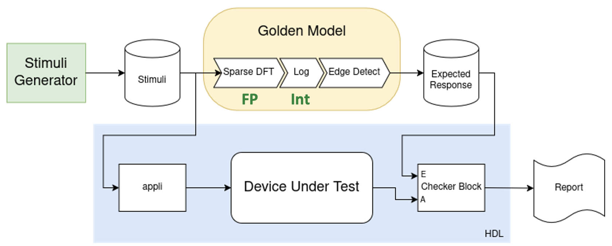
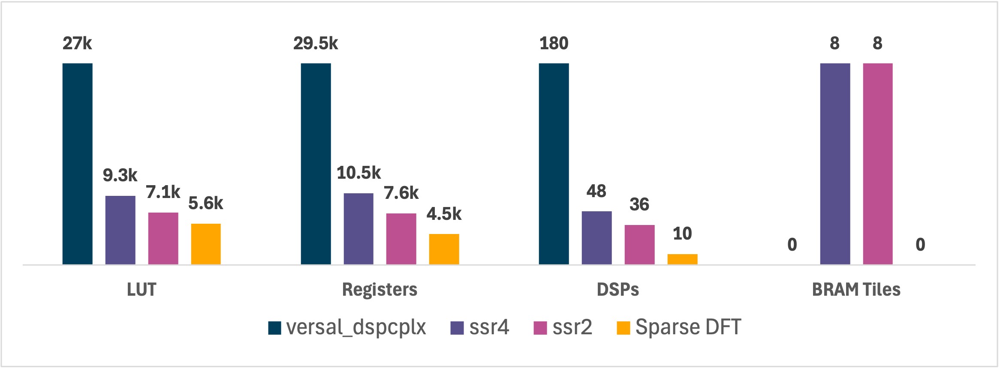

# Real-Time Adaptive Data Compression for Ultrafast Ultrasound: FPGA-Based Streaming Bandwidth Estimation

See the full functional description and experimental results in the [technical report](docs/technical_report.pdf).

## Introduction
This repository contains the hardware implementation and verification infrastructure for a real-time closed-loop bandwidth estimation architecture using a streaming sparse DFT core developed for the ListenToLight platform, developed by the Integrated Systems Laboratory at ETH Zurich. The RTL is the main contribution: a **BRAM‑free**, **deeply pipelined**, **time‑multiplexed** architecture that computes a sparse set of frequency bins in a streaming fashion to enable **real‑time bandwidth estimation and adaptive decimation** of incoming I/Q demodulated ultrasound datastreams. The design targets a Xilinx ZU19EG device.

The simulator provides a golden model, stimuli generation,  verification support, and behavioral validation.

## Scientific Context
ListenToLight is a high-end optoacoustic ultrasound imaging platform featuring 256 transducer channels and a state of the art analog front end (AFE), sampling at 125 MSPS. As a result, extremely large data volumes are generated, while the bandwidth between the data acquisition hardware and the host system remains severely constrained. Consequently, there is a critical need for efficient data compression for high-performance ultrasound systems like ListenToLight.


*Complete System Overview of the ListenToLight Platform*

The main objective of this project was to optimize the data transfers specifically for this system, utilizing the heterogeneous hardware provided by ListenToLight, namely: the FPGA, the APU and the AFE with onboard I/Q-demodulation and programmable filters.

The key idea is to adaptively adjust the AFE decimation factor based on the incoming measured data, ensuring weakly lossy compression: If the precise bandwidth edges of the streaming I/Q ultrasound signal are known, the maximum safe decimation factor can be determined according to the Nyquist theorem. Since we are only interested in the bandwidth edges rather than the entire spectrum, a full FFT is overkill, which is why we propose a streaming sparse DFT that only determines the bandwidth edges precisely. This algorithm is mapped in a closed-loop manner to the architecture of ListenToLight as illustrated in the following figure:


*Hardware Partitioning of the Proposed Algorithm onto the Heterogeneous Architecture of ListenToLight*

#### RTL Architecture
The streaming bandwidth estimation module is designed to run at 375 MHz. It is configured via a serial AXI-Stream interface that allows for real-time dynamic reprogramming of the frequency bins of interest of the sparse DFT. It outputs the bandwidth edges (specifically the location of the frequency bins in between which the bandwidth threshold crossing happens, and their corresponding power levels.) For the detailed description of the modules, refer to Chapter 4 in the [technical report](docs/technical_report.pdf) and the `rtl/src/` directory.

#### APU: Configuration & Control
The APU sets the locations for the sparse DFT bins. It then receives the edge bins around the bandwidth threshold crossing and their corresponding power levels from the FPGA. To find the exact bandwidth edges, the APU performs linear interpolation. With these precise bandwidth edges, the APU can refine the bin placement of the sparse DFT for the next iteration, as shown in the following figure. Additionally, it can calculate the maximum safe decimation factor.


*Iterative Refinement Process of the Frequency Bin Placement for the Sparse DFT*

#### Adaptive Control of the AFE
The AFE receives the decimation factor calculated by the AFE and decimates accordingly. To prevent aliasing, we need to design a low-pass filter with appropriate cutoff. The transducer frequency behavior already attenuates the bandwidth edges quite significantly (-6 dB). Hence, using a generic low-pass filter is suboptimal because it attenuates the bandwidth edges even further, which can lead to permanent information loss in signal content. It would be smarter to employ an "edge-boosting" filter that equalizes the nonidealities of the transducer frequency behavior. We have shown in a static proof-of-concept (`simulator/filter_design`), that this approach achieves a precision gain over a generic low-pass filter, as well as equivalent equalization when implemented on an FPGA in a subsequent processing stage, due to the intermediate requantization steps. The resulting improvement in effective resolution is quantified in the section **Key Results**. Thus, a real-time adaptation of this approach could prove to be interesting/useful for future work.

For further details about the algorithms, system overview and implementation, refer to the [technical report](docs/technical_report.pdf).

## Usage and Implementation
- RTL
  - SystemVerilog modules implement:
    - Streaming sparse DFT engine (24 selected bins, streaming windows).
    - Real‑time dB conversion, thresholding, and left/right edge detection for bandwidth estimation.
  - Target: Xilinx ZU19EG (Zynq UltraScale+ family). Aimed to run at 375 MHz
  - Vivado Version: 2024.2 


- Simulator
  - Python reference model implementing the sparse DFT, power conversion, threshold logic and verification analysis.
  - Stimulus generators produce test vectors consumed by SystemVerilog testbenches.
  - Proof-of-concept for the adaptive decimation filtering on the AFE.

## Quick start
1. Inspect the [technical report](docs/technical_report.pdf) for algorithms, design rationale and experimental results.
2. Download Datasets from the [PICMUS challenge](https://www.ustb.no/ustb-datasets/) (or any other hdf5  ultrasound dataset) and move them into the `simulator/datasets/` directory.
3. Generate stimuli (example):
   - `cd simulator/generate_stimuli`
   - `python generate_dft_power_vectors.py`
   - Ensure the paths in the generate stimuli scripts match with the folder structure inside `simulator/datasets/`.
4. Run the automated behavioral simulation of the RTL (batch, no GUI) using helper scripts:
   - `cd rtl/scripts`
   - `./full_simulation_flow.sh [NUM_TESTS]`
   - Datasets to be tested can be specified inside the `full_simulation_flow.sh` script.
   - Again, the paths must align with the folder structure inside `simulator/datasets/`.
5. Compare RTL outputs to a full floating point ground truth FFT using `rtl/sim_results/analyze_results.py`. The RTL outputs are explicitly not compared to the golden model, since this is supposed to be very hardware accurate.

## Testbench Support


*Hardware Accurate Golden Model*

The verification of the RTL was done using a **hybrid-precision golden model**. The golden model for the sparse DFT is written with floating point precision, while the subsequent power conversion includes an integer log2 calculation, which effectively acts as a quantization. This makes the overall golden model hardware accurate despite using floating point precision for some steps.

Various SystemVerilog testbenches are provided for unit and integration verification:
- **Module-level TBs** for the sparse DFT, dB converter, thresholding logic and edge detectors.
- **top_tb.sv**: The primary integration testbench that instantiates and verifies the full pipeline end‑to‑end. 
- **Automation**: The provided scripts inside the `rtl/scripts/` directory (`compile_elaborate.tcl`, `run_sim.tcl`, `full_simulation_flow.sh`) allow running `top_tb` in no‑GUI (batch) mode from the terminal to process multiple large datasets and write the simulation results into csv files for further analysis autonomously.
- The testbenches rely on the stimuli in `rtl/simvector` that were generated using the scripts in the `simulator/generate_stimuli` directory; ensure the paths in `generate_vectors_top.py` lign up with the actual dataset structure before running the automated batch simulation.

## Repository overview
Note: large vivado simulation and build directories and other heavy artifacts are intentionally excluded via [`.gitignore`](.gitignore).

### Abridged Repository Tree
```markdown
.
├── .gitattributes
├── .gitignore
├── LICENSE
├── docs
│   ├── figures                             # figures for the README 
│   └── technical_report.pdf                # complete technical report (thesis)
├── rtl
│   ├── scripts                             # compile/run simulation helper scripts 
│   │   ├── compile_elaborate.tcl
│   │   ├── full_simulation_flow.sh
│   │   └── run_sim.tcl
│   ├── sim_results                         # behavioral simulation results
│   ├── simvectors                          # stimuli for the testbenches
│   ├── src
│   │   ├── archive
│   │   ├── bandwidth_edge_detector.sv
│   │   ├── dft_accumulation_cordic_tmux_streaming.sv
│   │   ├── spectral_power_estimator_tmux.sv
│   │   ├── top.sv
│   │   └── ...
│   └── tb                                  # testbenches
│       ├── archive
│       ├── bandwidth_edge_detector_tb.sv
│       ├── spectral_power_estimator_tmux_tb.sv
│       ├── top_tb.sv
│       └── ...
└── simulator                               # golden model and stimuli generation
    ├── filter_design                       # static PoC of adaptive decimation filter
    │   ├── arbmag_lpf_design.m
    │   ├── generic_lpf_design.m
    │   └── simulate_filter_correction.py
    ├── generate_stimuli                    # scripts to generate stimuli for tb
    │   ├── fixed_float_conversions.py
    │   ├── generate_dft_power_vectors.py
    │   ├── generate_vectors_bandwidth_edge_detector.py
    │   ├── generate_vectors_top.py
    │   └── ...
    ├── notebooks
    │   └── calc_decimation_factor.ipynb
    └── src                                 # golden model and helper scripts
        ├── afe_interface_rf.py
        ├── complete_system_model_test.py
        ├── complete_system_model.py
        └── ...
```

## Key Results
### Achieved Compression
Achieved a **3.2-3.4x compression improvement** over fixed baseline decimation factor M=4 (**68-70% BW savings**). The fixed baseline corresponds to the minimal decimation factor necessary to satisfy the AFE - FPGA BW constraints (no additional compression).

Achieved a **~1.1x compression improvement** over naive compressor (M=12) (**7-12% BW savings**). This corresponds to a static worst-case decimation factor determined from the transducer specifications.

In the following table, the exact results can be seen for several experimental and in vivo PICMUS datasets:

| Dataset | Avg M | Data Kept | vs Naive | vs Baseline|
|----------|----------|----------|----------|----------|
| Baseline (fixed) | 4.0 | 25% | - | - |
| Naive (fixed) | 12.0 | 8.33% | 3.0x (66.7%) | - |
| `contrast_speckle` | 13.56 | 7.4% | 3.39x (70.5%) | 1.13x (11.5%) |
| `resolution_distorsion` | 13.69 | 7.3% | 3.42x (70.8%) | 1.14x (12.3%) |
| `carotid_cross` | 12.88 | 7.8% | 3.22x (68.9%) | 1.07x (6.8%) |
| `carotid_long` | 13.07 | 7.6% | (69.4%) | 1.09x (8.2%) |

The compression achieved a **decimation safety of >98.6%** (meaning that the bandwidth is always slightly overestimated, such that the decimation factor is never overestimated, resulting in perfect reconstructability) and a functional accuracy of **<4.4% Mean Absolute Percentage Error** on the bandwidth edge estimates.

### Resource Utilization
The full real-time BW estimation core is very lightweight with the following resource utilization (relative to the total available resources on the ZU19EG in %):
- 6515 (1.2%) LUT 	
- 5805 (0.6%) FF	
- 12 (0.6%) DSPs 	
- 0 (0%) BRAM


*Comparison of the resource utilization of the proposed sparse DFT core against streaming FFT IP cores provided by Xilinx with similar frequency resolutions*

The key advantages of the proposed architecture are:
- **Zero BRAM usage**: Important because other IP cores running on the Zynq already use the BRAM quite heavily (mainly the RDMA). Otherwise, BRAM constraints would become the primary bottleneck when scaling up the design to a large number of channels.
- **Very lightweight module**: Enables easy multi-channel scaling, which is necessary for high channel count systems like ListenToLight (256 ch).

For the full detailed resource utilization (CLB LUTs, CLB Regs, CARRY8, F7 Muxes, F8 Muxes, CLB, LUT as Logic, LUT as Memory, BRAM Tiles, DSPs), refer to table 5.4 in the complete [technical report](docs/technical_report.pdf).

### Proof of Concept: Precision Gain via Adaptive AFE Low-pass Filtering
Using the Adaptive AFE Decimation Low-Pass Filter (Edge-Boost) strategy yielded a **+4.92 dB improvement in SINAD** (Signal-to-Noise-and-Distortion Ratio) compared to standard generic low-pass filters. This translates to a precision gain of **+1.97 Bits in Effective Resolution**.

## License
See [`LICENSE`](LICENSE).